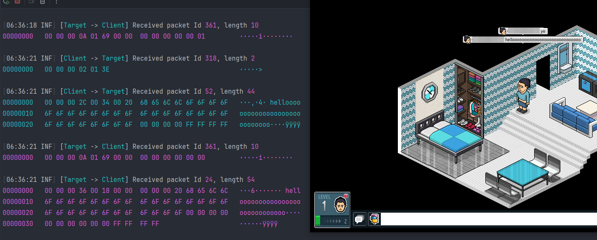

# Habbo2020-Desktop

_Work in progress_

This repository is a continuation of my [research in 2020](https://github.com/UnfamiliarLegacy/Habbo2020).  
The main intent is to help out [Tanji](https://github.com/ArachisH/Tanji) to support the Unity client.

## Warning

**Never** connect to the Habbo server with an invalid client certificate.  
If you do this **you will get banned for 100 years**.  

This project has certificate validation built in to prevent this mistake.  
**Use at your own risk.**

## Usage

1. Refresh the self-signed SSL certificates in `src/MitmServerNet/Certificates/Self`.   
`openssl req -x509 -newkey rsa:4096 -keyout key.pem -out cert.pem -sha256 -days 3650 -nodes -subj "/C=XX/ST=StateName/L=CityName/O=CompanyName/OU=CompanySectionName/CN=CommonNameOrHostname"`
2. Enter Habbo certificate password in `src/MitmServerNet/appsettings.json`.
3. Patch Unity client. _Example code coming soon_
4. Play Habbo.

## Client Protocol

Describes how the Habbo Unity client connects to the Habbo server.

### 1. Connect with WebSocket

The client connects to the Habbo server at `wss://game-us.habbo.com:30001/websocket`.

```
GET /websocket HTTP/1.1

User-Agent: websocket-sharp/1.0
Upgrade: websocket
Connection: Upgrade
Host: game-us.habbo.com:30001
Sec-WebSocket-Key: dGhlIHNhbXBsZSBub25jZQ==
Sec-WebSocket-Version: 13
```

### 2. mTLS Handshake

Client sends `StartTLS`, server replies with `OK`.  
Afterwards it does the mTLS handshake using the BouncyCastle [TlsClientProtocol.cs](https://github.com/bcgit/bc-csharp/blob/e1bbb04c4de1b249165f3f9c1a2a8aa896c8f10b/crypto/src/tls/TlsClientProtocol.cs#L331).

Client receives handshake messages in this order.

```
- server_hello (2)
- certificate (11)
- server_key_exchange (12) 
- certificate_request (13)
- server_key_exchange (14)
- finished (20)
```

For the `certificate_request` the client **must** send a valid certificate, **THIS IS VERY IMPORTANT**.  
It will work without but you will get a ban for **100 years**.  

In the Habbo client this certificate is loaded as such:

```csharp
using System.Security.Cryptography.X509Certificates;

var certificateData = Convert.FromBase64String("MIIQUQIBAzCCEBcG....");
var certificate = new X509Certificate(certificateData, "yai7th....");
```

Meaning you can reliably dump the certificate if you hook `X509Certificate(byte[] rawData, string password)`.  
The certificate subject is `CN=Habbo-Client-habbo2020-PROD-1455, OU=Habbo_Client, O=Sulake Oy, L=Helsinki, S=Uusimaa, C=FI`.

See the code in [Middle.cs#ConnectToHabbo](https://github.com/UnfamiliarLegacy/Habbo2020-Desktop/blob/ac3b91260071096a547d076b499ac32c8804a6e6/src/MitmServerNet/Net/Middle.cs#L119-L156) for a working example.

### 3. Diffie Hellman

Next up is the diffie hellman handshake that is also used in the flash client.  
Important packet in order.

#### Client - ClientHelloMessageComposer [4000]

Contains a 8 byte nonce for the ChaCha20 cipher used later.

```csharp
var nonce = packet.ReadString();
var nonceHex = string.Empty;

for (var i = 0; i < 8; i++)
{
    nonceHex += nonce.Substring(i * 3, 2);
}

_nonce = Convert.FromHexString(nonceHex);
```

#### Client - InitDiffieHandshakeMessageComposer [207]

Prompts the server to start with the handshake.

#### Server - InitDiffieHandshakeEvent [278]

Sends signed prime and generator, client decrypts with embedded RSA public key.  
The embedded RSA public key is loaded using `BigInteger.Parse(string value, NumberStyles style)` as hex.

#### Client - CompleteDiffieHandshakeMessageComposer [208]

Client sends encrypted DHPublic to the server, server decrypts with RSA private key and calculates a shared key.

#### Server - CompleteDiffieHandshakeEvent [279]

Server sends encrypted DHPublic to the client, client decrypts with RSA public key and calculates a shared key.

The client and server both have a shared key (up to 32 bytes) and a nonce (8 bytes). These are used for [ChaCha20](https://github.com/UnfamiliarLegacy/Habbo2020-Desktop/blob/master/src/MitmServerNet/Net/Crypto/HabboChaCha20.cs).  
The shared key must be padded with `0x00` bytes up to 32 bytes.

### 4. Shuffled communication

Using ChaCha20 you must encrypt and decrypt all the **packet ids** sent to and received from the Unity client.

```csharp
private static void Process(HabboChaCha20 cipher, Span<byte> header)
{
    Span<byte> headerReverse = stackalloc byte[2];
    
    headerReverse[0] = header[1];
    headerReverse[1] = header[0];
    
    cipher.Process(headerReverse);
    
    header[0] = headerReverse[1];
    header[1] = headerReverse[0];
}
```

## Screenshot


